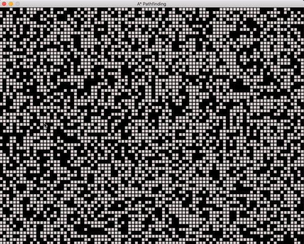

# A* Pathfinding

A* pathfinding algorithm using Pygame



## Install Pygame

Use the package manager [pip](https://pip.pypa.io/en/stable/) to install Pygame

```bash
python3 -m pip install -U pygame --user
```

## Run
```bash
python main.py
```
## Controls

LeftMouse - select starting point

RightMouse - select ending point

Space - blank grid

1-6 - randomize grid with obstacles with different density

Enter/Return - start/restart algorithm if both start and end point have been selected

T - switch between manhatten(taxi) and euclidian distance

Up/Down arrows - change speed of program
